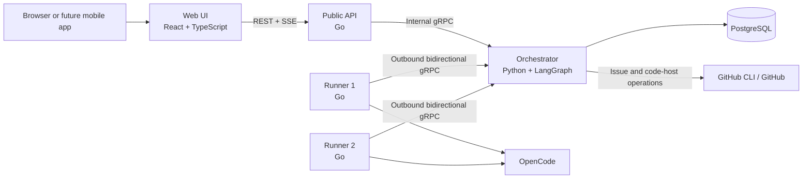
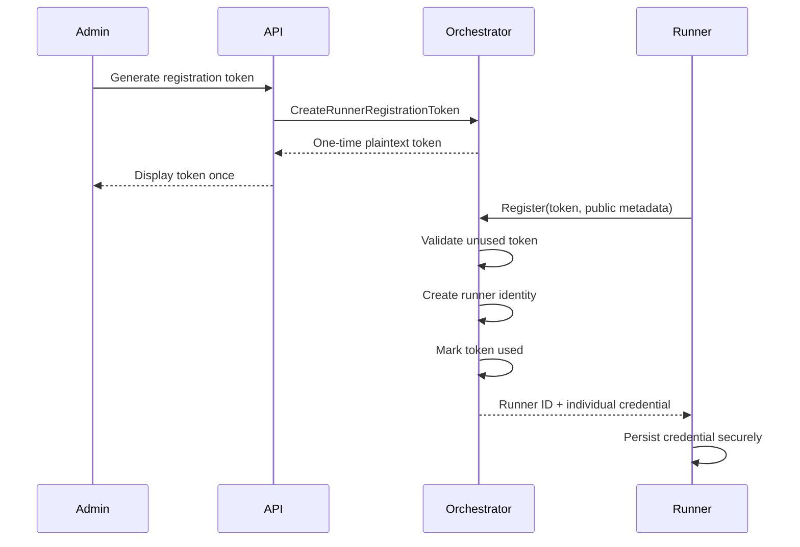
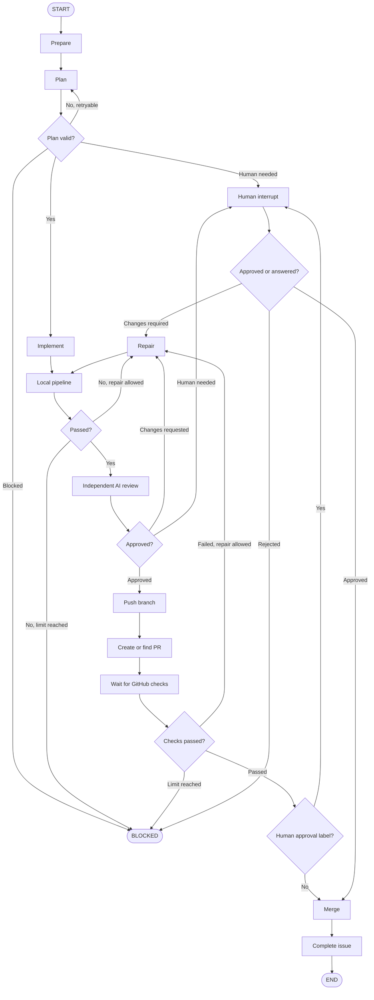

# Moirai Platform

## PROJECT.md

**Document status:** Architecture and system-design proposal for review  
**Target release:** Working MVP  
**Deployment target:** Self-hosted homelab using Docker Compose  
**Primary workflow engine:** LangGraph  
**Initial issue tracker:** GitHub Issues through the GitHub CLI  
**Initial coding-agent backend:** OpenCode  
**Primary database:** PostgreSQL  
**Public API:** Go  
**Orchestrator:** Python  
**Runner:** Go  
**Web UI:** React and TypeScript  

---

# 1. Executive summary

The Moirai Platform is a self-hosted control plane for autonomous software-engineering workflows.

The platform manages several software projects, continuously discovers eligible issues, ranks those issues globally, and assigns the highest-priority available issue to the next compatible runner. Each runner executes one job at a time. The scheduler permits only one active workflow per project, preventing two agents from modifying the same repository concurrently and reducing merge-conflict risk.

Each issue is processed through a durable LangGraph workflow. The workflow coordinates planning, implementation, deterministic project validation, independent AI review, pull-request creation, GitHub checks, repair loops, optional human approval, automatic merge, and issue completion.

The platform is designed around four boundaries:

1. **The orchestrator owns durable state and decisions.**
2. **Runners execute work but do not own workflow truth.**
3. **Issue trackers and coding agents are accessed through portable interfaces.**
4. **Deterministic checks decide whether work is complete; an agent cannot declare success by itself.**

The MVP uses GitHub Issues and OpenCode, but neither is embedded into the core domain model. GitHub is implemented behind issue-tracker and code-host interfaces using the `gh` CLI. OpenCode is implemented behind a generic agent-backend interface. Future implementations can add GitLab, Jira, Linear, Claude Code, Codex, Aider, or custom agents without replacing the scheduler or workflow engine.

The platform runs as a Docker Compose stack with separate containers:

- `web`: replaceable React frontend.
- `api`: public Go REST API and live-event gateway.
- `orchestrator`: Python control plane running LangGraph and owning all PostgreSQL access.
- `runner`: one or more Go execution workers.
- `postgres`: application and LangGraph persistence.

Only the orchestrator is allowed to access PostgreSQL. The Web UI communicates only with the public API. The API communicates with the orchestrator through internal gRPC. Runners establish outbound, authenticated, bidirectional gRPC streams to the orchestrator in a model similar to self-hosted CI runners.

---

# 2. Problem statement

Coding agents can implement scoped tasks, but autonomous software delivery requires a reliable system around the agent.

A simple loop such as:

```text
fetch issue
→ ask an agent to implement it
→ ask whether it is complete
→ repeat
```

is not sufficient because it does not reliably handle:

- Several projects competing for a limited runner fleet.
- Global issue prioritization.
- Project-level concurrency restrictions.
- Agent crashes or provider outages.
- Orchestrator restarts.
- Network disconnections.
- Processes that hang indefinitely.
- Agents that repeat the same failed action.
- Agents that forget the original objective.
- Invalid or unstructured agent output.
- CI failures after a pull request is opened.
- Review findings that require another implementation cycle.
- Human approval for selected work.
- Duplicate pull requests or duplicated external side effects.
- Runner ownership after a lease expires.
- Replacing one agent product with another.
- Replacing GitHub with a different issue tracker.
- Visibility into active work, failures, logs, and recovery.

The platform solves these problems by treating the agent as one replaceable execution component inside a deterministic, persisted workflow.

---

# 3. Product goals

## 3.1 MVP goals

The MVP must provide the following capabilities.

### Multiple projects

- Register several projects.
- Enable or disable each project independently.
- Support an existing local repository path.
- Support an application-managed clone from a Git URL.
- Configure each project independently.
- Synchronize eligible issues from every enabled project.

### Global scheduling

- Maintain one global queue across all enabled projects.
- Select the highest numeric issue priority across all projects.
- Use the issue creation timestamp as the default tie-breaker.
- Skip projects with an active workflow.
- Skip issues that are blocked, already running, delivered, or otherwise ineligible.
- Assign work only to compatible and available runners.

### Project concurrency

- Permit only one active workflow per project.
- Keep the project locked while work is being implemented, reviewed, repaired, waiting for checks, or waiting for required human approval.
- Prevent another runner from starting an issue for the same project until the current workflow reaches a terminal state.

### Runner fleet

- Support several runner containers.
- Each runner executes exactly one job at a time.
- Runners connect outbound to the orchestrator.
- Runners advertise capabilities and labels.
- Runners send heartbeats and lease renewals.
- Runners reconnect safely after temporary network failure.
- Runners can be disabled, drained, or revoked.
- A failed or expired runner lease can be recovered by the orchestrator.

### Durable issue workflow

- Use LangGraph for the per-issue workflow.
- Persist checkpoints in PostgreSQL.
- Resume after orchestrator restarts.
- Support bounded repair loops.
- Support human interrupts.
- Preserve workflow history and events.
- Keep workflow state independent from an OpenCode conversation.

### Portable integrations

- Define a generic issue-tracker interface.
- Implement GitHub Issues through a GitHub CLI adapter for the MVP.
- Define a generic code-host interface.
- Implement GitHub pull requests, checks, reviews, and merge through `gh`.
- Define a generic agent-backend interface.
- Implement OpenCode first.
- Define local-process and Docker execution modes.

### Complete delivery flow

- Create or prepare an isolated branch or worktree.
- Ask an agent to plan.
- Ask an agent to implement.
- Run configured deterministic local pipeline commands.
- Run an independent AI review with fresh context.
- Repair pipeline and review failures within limits.
- Push a branch.
- Open a pull request.
- Monitor GitHub required checks.
- Repair GitHub check failures within limits.
- Require human approval only when a configured label is present.
- Automatically merge when all required gates pass.
- Complete or close the source issue after merge.

### Web administration

- Local username/password login.
- Project registration and configuration.
- Runner registration token creation.
- Runner status and capability view.
- Global issue queue.
- Active workflow dashboard.
- Workflow phase and attempt counts.
- Logs and events.
- Retry, resume, cancel, and block controls.
- Human approval controls.
- Application settings and health status.

---

# 4. Non-goals for the MVP

The MVP intentionally excludes the following:

- Kubernetes deployment.
- Multi-region operation.
- Multiple active orchestrator leaders.
- Hosted multi-tenant SaaS.
- Enterprise SSO.
- Full role-based access control.
- Several simultaneous jobs on one runner.
- Several simultaneous issues for the same project.
- Cross-repository atomic changes.
- Arbitrary user-designed workflows.
- A visual LangGraph editor.
- Native Jira, Linear, or GitLab integrations.
- Native Claude Code, Codex, or Aider integrations.
- Automatic deployment to production.
- Production credentials in agent environments.
- Full billing and cost allocation.
- Object-storage log archival.
- Remote interactive shell access.
- Guaranteed preservation of uncommitted data after permanent runner-host loss.
- Automated database migrations in target projects without project-specific approval rules.
- Automatic merging when branch-protection requirements cannot be satisfied.

---

# 5. Confirmed architectural decisions

| Area | Decision |
|---|---|
| Hosting | Self-hosted homelab |
| Deployment | Docker Compose |
| Web UI | React and TypeScript in a separate container |
| Public API | Go in a separate container |
| Orchestrator | Python in a separate container |
| Workflow engine | LangGraph |
| Runner | Go |
| Database | PostgreSQL |
| Database access | Orchestrator only |
| API-to-orchestrator communication | Internal gRPC |
| Runner-to-orchestrator communication | Outbound bidirectional gRPC |
| Runner capacity | One active job |
| Project concurrency | One active workflow per project |
| Runner registration | One-time token exchanged for an individual credential |
| User authentication | Local username and password |
| Issue tracker | GitHub Issues for the MVP |
| Tracker implementation | GitHub CLI adapter behind a portable interface |
| Priority | Numeric labels, higher number first |
| Eligibility | Configurable label, default `agent:ready` |
| Initial agent | OpenCode |
| Agent portability | Generic agent-backend contract |
| Execution | Local process and Docker |
| Repository source | Existing local path or managed clone |
| Delivery gates | Local pipeline, AI review, GitHub required checks |
| Human approval | Required only when a configured label is present |
| Completion | Automatic merge and source-issue completion |

---

# 6. Core design principles

## 6.1 The orchestrator is authoritative

The orchestrator owns:

- Project configuration.
- Issue snapshots.
- Global scheduling.
- Project locks.
- Runner identity and leases.
- LangGraph state.
- Retry policies.
- Workflow completion.
- GitHub state reconciliation.
- Audit history.

Runner memory, agent conversation state, and process output are not authoritative.

## 6.2 Agents do not decide completion

An agent may return a structured recommendation such as:

```json
{
  "status": "implemented",
  "summary": "Added idempotency handling",
  "changedFiles": ["internal/transfers/service.go"]
}
```

This does not complete the workflow.

Completion requires deterministic and independent gates:

- Expected repository changes exist.
- Local pipeline passes.
- AI reviewer approves.
- GitHub required checks pass.
- Human approval is present when required.
- Merge succeeds.
- The issue is reconciled as completed.

## 6.3 Portability through interfaces

The core does not depend directly on:

- GitHub issue JSON.
- GitHub issue numbers as universal IDs.
- OpenCode sessions.
- OpenCode-specific prompt tools.
- A particular Docker image.
- A particular LLM provider.

Provider-specific behavior is translated at adapter boundaries.

## 6.4 Durable state outside conversations

The original objective, acceptance criteria, plan, results, failures, and reviews are persisted as structured workflow state.

An agent session can be discarded and recreated without losing the task.

## 6.5 Bounded loops

Every loop has explicit limits:

- Maximum planning attempts.
- Maximum implementation attempts.
- Maximum pipeline repair attempts.
- Maximum AI review cycles.
- Maximum CI repair attempts.
- Maximum total agent executions.
- Maximum workflow age.
- Maximum execution duration.
- Optional token and cost budgets.

## 6.6 Idempotent side effects

Operations that affect external systems must be safe to retry:

- Adding labels.
- Creating branches.
- Pushing commits.
- Opening pull requests.
- Posting comments.
- Requesting reviews.
- Merging.
- Closing issues.

The orchestrator searches for an existing resource or uses an idempotency marker before creating another.

## 6.7 Lease fencing

A runner must not be able to complete a job after losing ownership.

Every job event includes:

- `job_id`
- `lease_generation`
- `event_sequence`

Events with an old generation are rejected.

---

# 7. High-level architecture



The public API and orchestrator are separate deployment units. This allows:

- Replacing the Web UI.
- Adding a mobile client.
- Maintaining a stable public API.
- Scaling or securing the public boundary independently.
- Changing internal orchestration without exposing it directly.

---

# 8. Service responsibilities

## 8.1 Web UI

### Technology

- React.
- TypeScript.
- Vite.
- Static production build served by a small HTTP server or reverse proxy.
- REST for commands and queries.
- Server-Sent Events for live updates in the MVP.

### Responsibilities

- Render login.
- Store no permanent secrets.
- Register and configure projects.
- Display global queue.
- Display active and historical workflow runs.
- Display runners and health.
- Generate one-time runner registration tokens.
- Display streamed logs and workflow events.
- Offer retry, resume, cancel, block, and approval actions.
- Display system health.
- Provide configuration forms with validation.

### Explicit restrictions

The Web UI must not:

- Access PostgreSQL.
- Connect directly to runners.
- Connect directly to the orchestrator.
- Construct executable shell commands from unvalidated free text.
- Store GitHub tokens in browser storage.
- Make workflow decisions.

---

## 8.2 Public API

### Technology

Recommended Go stack:

- Go standard HTTP server.
- `chi` or another minimal router.
- `grpc-go` internal client.
- Secure cookie sessions.
- SSE event proxy.
- JSON request and response models.

### Responsibilities

- Expose `/api/v1`.
- Authenticate users.
- Validate requests.
- Authorize administrative actions.
- Apply CSRF protection.
- Apply rate limits.
- Translate REST calls into internal gRPC calls.
- Translate orchestrator responses into stable public models.
- Subscribe to orchestrator event streams.
- Forward filtered live events over SSE.
- Hide internal implementation details.

### Database restriction

The API receives no PostgreSQL credentials.

Authentication operations are sent to the orchestrator, which owns users and sessions.

### Suggested package layout

```text
api/
├── cmd/api/main.go
├── internal/config/
├── internal/http/
│   ├── router.go
│   ├── middleware/
│   ├── auth/
│   ├── projects/
│   ├── runners/
│   ├── queue/
│   ├── workflows/
│   ├── settings/
│   └── events/
├── internal/orchestrator/
│   ├── client.go
│   └── mapper.go
└── internal/observability/
```

---

## 8.3 Orchestrator

### Technology

Recommended Python stack:

- Python 3.12 or later.
- LangGraph.
- PostgreSQL LangGraph checkpointer.
- `grpc.aio`.
- Protocol Buffers.
- `psycopg` or SQLAlchemy async.
- Alembic for schema migrations.
- Structured JSON logging.
- OpenTelemetry-compatible tracing where practical.

### Responsibilities

The orchestrator is the control plane.

It owns:

- PostgreSQL.
- User persistence.
- Session persistence.
- Project configuration.
- Issue synchronization.
- Scheduling.
- Project locks.
- Runner registry.
- Runner credentials.
- Job offers.
- Job leases.
- LangGraph workflows.
- Workflow checkpoints.
- Retry policies.
- Circuit breakers.
- GitHub issue adapter.
- GitHub code-host adapter.
- External-state reconciliation.
- Workflow events.
- Audit events.
- Internal gRPC API.
- Runner-control gRPC service.

### Suggested package layout

```text
orchestrator/
├── pyproject.toml
├── alembic.ini
├── migrations/
└── src/moirai/
    ├── main.py
    ├── config/
    ├── domain/
    │   ├── authentication/
    │   ├── projects/
    │   ├── issues/
    │   ├── scheduling/
    │   ├── runners/
    │   └── workflows/
    ├── application/
    │   ├── commands/
    │   ├── queries/
    │   └── services/
    ├── workflows/
    │   ├── issue_graph.py
    │   ├── state.py
    │   ├── routes.py
    │   └── nodes/
    ├── scheduler/
    ├── runners/
    ├── issue_trackers/
    ├── code_hosts/
    ├── persistence/
    ├── grpc/
    ├── events/
    ├── security/
    └── observability/
```

---

## 8.4 Runner

### Technology

Recommended Go stack:

- Go.
- `grpc-go`.
- `os/exec`.
- Docker Engine API.
- Protocol Buffers.
- Structured logging.
- Context-based cancellation.
- Process-group termination.

### Responsibilities

A runner:

1. Loads or creates its local identity.
2. Registers using a one-time token or authenticates using an existing credential.
3. Opens an outbound gRPC stream.
4. Advertises capabilities and labels.
5. Sends heartbeats.
6. Receives at most one job offer.
7. Accepts or rejects the offer.
8. Renews its lease.
9. Prepares the repository workspace.
10. Executes requested operations.
11. Streams logs and progress.
12. Returns structured results.
13. Buffers events during short disconnections.
14. Reconnects with the same runner identity.
15. Cleans up according to configured retention.

### Runner does not

- Query the global issue queue.
- Connect to PostgreSQL.
- Decide the next workflow phase.
- Decide that an issue is complete.
- Merge without an explicit valid execution command.
- Execute a second job concurrently.

### Suggested package layout

```text
runner/
├── cmd/runner/main.go
├── internal/config/
├── internal/identity/
├── internal/control/
│   ├── client.go
│   ├── registration.go
│   ├── stream.go
│   ├── heartbeat.go
│   └── lease.go
├── internal/execution/
│   ├── supervisor.go
│   ├── local.go
│   ├── docker.go
│   └── cancellation.go
├── internal/agents/
│   ├── backend.go
│   ├── opencode.go
│   ├── generic_cli.go
│   └── docker_cli.go
├── internal/repository/
├── internal/workspace/
├── internal/logs/
└── internal/observability/
```

---

# 9. Deployment topology

## 9.1 Docker Compose services

```yaml
services:
  postgres:
    image: postgres
    networks:
      - database

  orchestrator:
    build: ./orchestrator
    depends_on:
      - postgres
    networks:
      - database
      - control

  api:
    build: ./api
    depends_on:
      - orchestrator
    networks:
      - control
      - public

  web:
    build: ./web
    depends_on:
      - api
    networks:
      - public

  runner-1:
    build: ./runner
    depends_on:
      - orchestrator
    networks:
      - control

  runner-2:
    build: ./runner
    depends_on:
      - orchestrator
    networks:
      - control

networks:
  public:
  control:
  database:
    internal: true
```

This is illustrative rather than a final Compose file.

## 9.2 Network rules

- PostgreSQL is reachable only from the orchestrator.
- The API is reachable from the Web UI and reverse proxy.
- The API can reach the orchestrator.
- Same-host runners can reach the orchestrator on the control network.
- Remote runners use a TLS endpoint.
- The Web UI cannot reach PostgreSQL, runners, or the orchestrator directly.

## 9.3 Persistent volumes

Suggested volumes:

```text
postgres-data
orchestrator-data
runner-1-data
runner-2-data
```

Runner volumes contain:

- Runner identity.
- Runner credential.
- Managed repository cache.
- Workspaces.
- Worktrees.
- Buffered logs.
- Pending result envelopes.
- Agent session metadata when supported.

---

# 10. Project model

A project represents one repository and its autonomous-work configuration.

## 10.1 Required project fields

```text
id
name
enabled
repository_mode
repository_url
local_repository_path
default_branch
issue_tracker_type
code_host_type
required_runner_labels
created_at
updated_at
```

## 10.2 Repository modes

### Managed clone

The runner owns a cached clone.

Configuration:

```text
repository_mode = managed_clone
repository_url = git@github.com:owner/repository.git
default_branch = main
```

Behavior:

- Runner creates a bare or standard cached clone.
- Runner fetches before starting.
- Runner creates a dedicated worktree for the job.
- Runner removes or archives the worktree after completion.
- Cache remains for later jobs.

### Existing local path

The project points to a path mounted into compatible runners.

Configuration:

```text
repository_mode = existing_path
local_repository_path = /repositories/my-service
default_branch = main
```

Requirements:

- The runner must advertise a label that indicates access.
- The path must be mounted into the runner.
- The orchestrator validates that at least one runner can serve the project.
- The runner still creates a dedicated worktree whenever possible.

Example runner requirement:

```text
repo:my-service
```

## 10.3 Project configuration categories

### Issue configuration

- Eligibility label.
- Numeric priority prefix.
- Running label.
- Blocked label.
- Failed label.
- Human-required label.
- Human-approval label.
- Review label.
- Delivered label.
- Optional ignored labels.
- Default priority.

### Workflow configuration

- Max planning attempts.
- Max implementation attempts.
- Max pipeline repair attempts.
- Max review cycles.
- Max CI repair attempts.
- Max total agent executions.
- Max workflow duration.
- Per-execution timeout.
- No-progress timeout.
- Repeated-failure threshold.

### Pipeline configuration

Ordered commands such as:

```yaml
pipeline:
  - name: format-check
    command: make format-check
    timeoutSeconds: 300
  - name: unit-tests
    command: make test
    timeoutSeconds: 1200
  - name: lint
    command: make lint
    timeoutSeconds: 600
```

### Agent configuration

- Backend name.
- Execution mode.
- Planner profile.
- Developer profile.
- Reviewer profile.
- Repair profile.
- Environment variables by secret reference.
- Optional model or provider configuration.
- Prompt-template overrides.
- Maximum agent runtime.

### Merge configuration

- Auto-merge enabled.
- Merge method: squash, merge, or rebase.
- Delete branch after merge.
- Required local pipeline.
- Required AI review.
- Required GitHub checks.
- Human-approval label.
- Maximum time waiting for checks.
- Maximum time waiting for human approval.

---

# 11. Issue-tracker abstraction

The core domain must not import GitHub-specific types.

## 11.1 Domain interface

Illustrative Python interface:

```python
from typing import Protocol

class IssueTracker(Protocol):
    async def list_eligible_issues(
        self,
        project: "Project",
    ) -> list["ExternalIssue"]:
        ...

    async def get_issue(
        self,
        project: "Project",
        external_issue_id: str,
    ) -> "ExternalIssue":
        ...

    async def add_labels(
        self,
        project: "Project",
        external_issue_id: str,
        labels: list[str],
    ) -> None:
        ...

    async def remove_labels(
        self,
        project: "Project",
        external_issue_id: str,
        labels: list[str],
    ) -> None:
        ...

    async def add_comment(
        self,
        project: "Project",
        external_issue_id: str,
        body: str,
        idempotency_marker: str,
    ) -> None:
        ...

    async def close_issue(
        self,
        project: "Project",
        external_issue_id: str,
    ) -> None:
        ...
```

## 11.2 Internal issue model

```text
provider
external_id
display_number
project_id
title
body
url
state
author
labels
created_at
updated_at
priority
eligible
human_approval_required
tracker_revision
raw_snapshot
```

The scheduler uses only the internal model.

## 11.3 GitHub CLI implementation

The MVP implementation is:

```text
IssueTracker
└── GitHubCliIssueTracker
```

It executes commands such as:

```bash
gh issue list
gh issue view
gh issue edit
gh issue comment
gh issue close
```

Requirements:

- Use JSON output where supported.
- Validate exit codes.
- Capture stderr.
- Apply command timeouts.
- Avoid parsing human-formatted tables.
- Redact tokens.
- Wrap all GitHub-specific fields at the adapter boundary.
- Retry only errors classified as transient.
- Use stable comment markers to avoid duplicates.

---

# 12. Code-host abstraction

Issue tracking and code hosting are separate concepts even when both use GitHub.

## 12.1 Interface responsibilities

```text
create_or_find_branch
push_branch
find_pull_request
create_pull_request
update_pull_request
get_required_checks
get_pull_request_reviews
enable_auto_merge
merge_pull_request
close_pull_request
get_default_branch_head
```

## 12.2 GitHub CLI implementation

```text
CodeHost
└── GitHubCliCodeHost
```

Possible commands:

```bash
gh pr create
gh pr view
gh pr checks
gh pr merge
gh api
```

The implementation must:

- Search for an existing PR before creating one.
- Include an internal workflow marker in the PR body.
- Use issue-closing syntax when appropriate.
- Respect branch protection.
- Distinguish pending, passing, failing, skipped, and cancelled checks.
- Never bypass required checks unless a future explicit policy allows it.

---

# 13. Label model

All default labels are configurable per project.

## 13.1 Eligibility and state labels

Recommended defaults:

```text
agent:ready
agent:running
agent:review
agent:blocked
agent:human-required
agent:human-approval
agent:failed
agent:delivered
```

## 13.2 Numeric priority labels

Format:

```text
agent-priority:<integer>
```

Examples:

```text
agent-priority:1000
agent-priority:250
agent-priority:100
agent-priority:10
agent-priority:0
agent-priority:-10
```

Rules:

- Higher numeric value means higher priority.
- Integers are signed.
- A project defines a default priority, initially `0`.
- When several priority labels exist, the MVP should use the highest parsed number and emit a warning event.
- Invalid labels are ignored and recorded.
- Priority is recalculated during synchronization.
- Oldest issue wins ties by default.
- A future scheduler strategy may support aging.

## 13.3 Eligibility

Default eligibility rule:

```text
issue is open
AND contains agent:ready
AND does not contain agent:blocked
AND does not contain agent:running
AND does not contain agent:delivered
AND project is enabled
AND project has no active workflow
```

The exact label names are configurable.

## 13.4 State transitions and labels

Example:

```text
queued:
  add agent:ready

claimed:
  remove agent:ready
  add agent:running

ai_review:
  add agent:review

waiting_human:
  add agent:human-required

blocked:
  remove agent:running
  add agent:blocked

failed:
  remove agent:running
  add agent:failed

merged:
  remove transient agent labels
  add agent:delivered
```

Label operations are reconciled and idempotent. Labels help users understand state, but PostgreSQL remains authoritative.

---

# 14. Global scheduling

## 14.1 Scheduler input

The scheduler considers:

- Enabled projects.
- Latest issue snapshots.
- Active project locks.
- Available runners.
- Runner capabilities.
- Project runner requirements.
- Project pause state.
- Provider circuit breakers.
- Global maintenance mode.

## 14.2 Selection order

The MVP global ordering is:

1. Higher numeric priority.
2. Older issue creation timestamp.
3. Older local queue insertion timestamp.
4. Stable project ID.
5. Stable external issue ID.

A deterministic final tie-break avoids inconsistent scheduler behavior.

## 14.3 Project concurrency rule

A project is schedulable only when it has no active workflow in any of these states:

```text
offered
preparing
planning
implementing
local_pipeline
repairing
ai_review
pushing
pr_created
waiting_github_checks
waiting_human
merging
recovering
```

## 14.4 Runner matching

A runner advertises labels such as:

```text
linux
amd64
docker
local-process
opencode
repo:my-service
gpu
```

A project may require:

```json
["linux", "docker", "opencode"]
```

A runner is compatible when it contains every required label and is:

- Connected.
- Authenticated.
- Enabled.
- Not draining.
- Idle.
- Healthy.
- Not circuit-broken.

## 14.5 Scheduling transaction

Conceptual transaction:

```text
1. Lock scheduler candidate rows.
2. Recheck issue eligibility.
3. Recheck project has no active lock.
4. Recheck runner is idle.
5. Insert job in offered state.
6. Insert project lock.
7. Insert offer with expiration.
8. Commit.
9. Send offer to runner.
```

If the runner does not accept before expiration:

```text
offer expires
→ job returns to queued/recoverable state
→ project lock is released
→ runner remains idle
```

## 14.6 Scheduler leadership

The MVP runs one orchestrator instance. Still, scheduler leadership should be represented by a PostgreSQL advisory lock or lease so accidental duplicate orchestrator processes do not both schedule.

---

# 15. Runner registration and authentication

## 15.1 One-time registration token

An administrator generates a token from the Web UI.

Stored fields:

```text
id
token_hash
created_by_user_id
created_at
expires_at
used_at
revoked_at
allowed_labels
optional_name_pattern
```

The plaintext token is shown once.

## 15.2 Registration flow



## 15.3 Runner credential

The MVP may use a long random bearer credential over TLS.

Persist only a secure hash in PostgreSQL.

Runner stores:

```text
runner_id
credential
orchestrator_endpoint
registration timestamp
```

Future versions may support mTLS.

## 15.4 Revocation and draining

Administrators can:

- Disable runner.
- Drain runner.
- Revoke runner credential.
- Delete offline runner record.
- Rotate runner credential.

Drain behavior:

```text
idle runner:
  stops accepting immediately

busy runner:
  finishes current job
  then becomes unavailable
```

---

# 16. Runner control protocol

## 16.1 Transport

Use Protocol Buffers and gRPC.

Runners create an outbound bidirectional stream:

```protobuf
service RunnerControl {
  rpc Connect(stream RunnerToOrchestrator)
      returns (stream OrchestratorToRunner);
}
```

## 16.2 Runner messages

Conceptual payloads:

```text
Register
Authenticate
Heartbeat
CapabilitiesChanged
JobOfferAccepted
JobOfferRejected
LeaseRenewal
ExecutionStarted
ExecutionProgress
LogBatch
ExecutionCompleted
ExecutionFailed
ExecutionCancelled
ReconnectState
RunnerDraining
```

## 16.3 Orchestrator messages

```text
RegistrationAccepted
AuthenticationAccepted
JobOffer
StartExecution
CancelExecution
LeaseAcknowledged
Drain
ConfigurationUpdate
Ping
CredentialRotation
```

## 16.4 Ordering fields

Every execution-related event includes:

```text
runner_id
job_id
execution_id
lease_generation
event_sequence
sent_at
```

The orchestrator rejects:

- Unknown job.
- Unknown execution.
- Wrong runner.
- Old lease generation.
- Duplicate event sequence when already persisted.
- Completion for an execution already terminated.

## 16.5 Heartbeat defaults

Initial recommended defaults:

```text
heartbeat interval: 10 seconds
lease renewal interval: 15 seconds
lease duration: 60 seconds
job offer timeout: 30 seconds
reconnect grace period: 60 seconds
```

These are configuration defaults, not hard-coded constants.

## 16.6 Disconnection handling

### Reconnect before lease expiration

```text
runner disconnects
→ job remains running
→ runner reconnects with same identity
→ sends active job and last event sequence
→ orchestrator validates generation
→ stream resumes
```

### Lease expiration

```text
runner misses lease deadline
→ runner marked offline
→ job enters recovering
→ project remains locked
→ old lease generation invalidated
→ orchestrator reconciles repository and external state
→ workflow resumes on same or different runner
```

The project lock must not be released immediately because uncommitted or externally visible work may exist.

---

# 17. Job and execution model

## 17.1 Job

A job represents one assigned issue workflow.

Fields include:

```text
id
workflow_run_id
project_id
issue_id
runner_id
status
lease_generation
lease_expires_at
offered_at
accepted_at
started_at
completed_at
recovery_reason
```

## 17.2 Execution

A job contains several executions:

```text
prepare_workspace
run_planner
run_developer
run_local_pipeline
run_reviewer
run_repair
git_push
cleanup_workspace
```

Each execution records:

```text
id
job_id
type
attempt
status
started_at
finished_at
timeout_seconds
exit_code
result_json
error_json
log_cursor
failure_fingerprint
```

## 17.3 One runner for the workflow

The MVP should prefer keeping one workflow on one runner because its workspace is local.

A workflow may move to another runner only during recovery. Recovery may require:

- Fetching the branch.
- Recreating the worktree.
- Rebuilding the task packet.
- Discarding an uncommitted attempt.
- Starting a fresh agent session.

The orchestrator must clearly record when an attempt is lost because it was never committed or pushed.

---

# 18. Repository and workspace isolation

## 18.1 Managed-clone layout

Example runner volume:

```text
/data/
├── identity/
├── repositories/
│   └── project-<id>/
│       └── repo.git
├── workspaces/
│   └── job-<id>/
│       ├── repository/
│       └── .loop/
└── logs/
```

## 18.2 Worktree strategy

Recommended:

```text
cached clone
→ fetch default branch
→ create branch agent/<issue>/<run>
→ create dedicated worktree
→ run workflow
→ push branch
→ retain for configured period
→ clean
```

Example branch:

```text
agent/1234/add-idempotency-run-a1b2c3
```

## 18.3 One project at a time

Even with worktrees, only one active job per project is permitted in the MVP. This avoids:

- Competing migrations.
- Conflicting generated files.
- Multiple pending branches requiring repeated rebases.
- Shared local development dependencies.
- Review and CI repair collisions.

## 18.4 Workspace task directory

Each workspace contains structured artifacts:

```text
.loop/
├── task.json
├── workflow-state.json
├── plan.json
├── implementation-result.json
├── pipeline-result.json
├── review-result.json
├── failures.json
├── result.json
└── logs/
```

These are not the system of record, but they provide a lowest-common-denominator contract for CLI agents.

---

# 19. Agent-backend abstraction

## 19.1 Go interface

Illustrative complete interface:

```go
package agents

import (
	"context"
	"time"
)

type Role string

const (
	RolePlanner   Role = "planner"
	RoleDeveloper Role = "developer"
	RoleReviewer  Role = "reviewer"
	RoleRepairer  Role = "repairer"
)

type Capabilities struct {
	StructuredOutput bool
	SessionResume    bool
	Cancellation     bool
	Streaming        bool
	TokenReporting   bool
	CostReporting    bool
	ToolPermissions  bool
}

type Request struct {
	ExecutionID      string
	Role             Role
	WorkspacePath    string
	InstructionsPath string
	ResultPath       string
	Timeout          time.Duration
	Environment      map[string]string
	SessionID        string
}

type Error struct {
	Type      string
	Message   string
	Retryable bool
}

type Result struct {
	Status       string
	ExitCode     int
	Summary      string
	SessionID    string
	ChangedFiles []string
	StdoutPath   string
	StderrPath   string
	Usage        map[string]float64
	Error        *Error
}

type Backend interface {
	Name() string
	Capabilities(ctx context.Context) (Capabilities, error)
	HealthCheck(ctx context.Context) error
	Execute(ctx context.Context, request Request) (Result, error)
	Cancel(ctx context.Context, executionID string) error
	Resume(ctx context.Context, request Request) (Result, error)
}
```

`Resume` may return a standardized unsupported error.

## 19.2 Initial implementations

```text
Backend
├── OpenCodeBackend
├── GenericCLIBackend
└── DockerCLIBackend
```

The OpenCode backend is the MVP default.

The Generic CLI backend allows future tools to be configured without immediately creating native code.

## 19.3 Tool-neutral task packet

Example:

```json
{
  "protocolVersion": "1.0",
  "executionId": "exec_123",
  "role": "developer",
  "objective": "Implement issue #42",
  "issue": {
    "externalId": "42",
    "title": "Make transfer creation idempotent",
    "body": "..."
  },
  "acceptanceCriteria": [
    {
      "id": "AC-1",
      "description": "Duplicate requests create one transfer",
      "verification": "Integration test using the same idempotency key"
    }
  ],
  "plan": {
    "steps": []
  },
  "previousFailures": [],
  "constraints": {
    "mayModifyFiles": true,
    "mayPush": false,
    "mayMerge": false
  },
  "expectedOutput": ".loop/result.json"
}
```

## 19.4 Structured result

```json
{
  "protocolVersion": "1.0",
  "executionId": "exec_123",
  "status": "completed",
  "summary": "Implemented idempotency-key persistence",
  "completedSteps": ["STEP-1"],
  "changedFiles": [
    "internal/transfers/service.go"
  ],
  "commandsRun": [
    "go test ./..."
  ],
  "remainingWork": [],
  "knownLimitations": []
}
```

The runner validates this result against a schema before returning it.

---

# 20. OpenCode backend

## 20.1 MVP behavior

The OpenCode backend must:

- Verify the `opencode` executable exists.
- Run in the assigned workspace.
- Receive a generated role prompt and task-packet path.
- Capture stdout and stderr.
- Enforce timeout.
- Support cancellation.
- Write the required result document.
- Report session ID when available.
- Avoid direct merge permissions.
- Avoid direct issue closure.
- Run with the minimum necessary permissions.

## 20.2 Prompt strategy

Every OpenCode phase receives:

```text
ROLE
IMMUTABLE OBJECTIVE
ISSUE
ACCEPTANCE CRITERIA
CURRENT PLAN
CURRENT REPOSITORY COMMIT
CURRENT DIFF SUMMARY
FAILED CHECKS
AI REVIEW FINDINGS
ALLOWED ACTIONS
FORBIDDEN ACTIONS
EXPECTED OUTPUT SCHEMA
```

The original issue and acceptance criteria remain immutable. New discoveries are added separately.

## 20.3 Fresh review context

The reviewer must not inherit the developer's full conversation.

The reviewer receives:

- Issue.
- Acceptance criteria.
- Plan.
- Current diff.
- Changed files.
- Pipeline results.
- Relevant repository context.
- No developer chain of thought.
- No instruction to defend the implementation.

## 20.4 Future agent backends

Later implementations may include:

```text
ClaudeCodeBackend
CodexBackend
AiderBackend
HttpAgentBackend
RemoteAgentBackend
```

No LangGraph node may import OpenCode-specific code.

---

# 21. Execution modes

## 21.1 Local-process executor

The command runs in the runner container or runner host environment.

Advantages:

- Fast startup.
- Simple.
- Direct access to mounted repositories.
- Useful for trusted homelab projects.

Risks:

- Weaker isolation.
- Agent or command can affect the runner container.
- Shared dependency state.
- Harder resource enforcement.

Requirements:

- Dedicated non-root user.
- Restricted mounted paths.
- Process-group termination.
- Sanitized environment.
- Explicit allowlists or project configuration.
- No production credentials.

## 21.2 Docker executor

The runner launches a separate container for the operation.

Advantages:

- Better filesystem and process isolation.
- Per-project images.
- CPU and memory limits.
- Disposable environment.
- Clear dependency definition.

Risks:

- Docker socket access is highly privileged.
- More startup overhead.
- More complex volume mapping.
- Nested Docker networking complexity.

MVP recommendation:

- Support both.
- Prefer Docker for autonomous jobs.
- Display a security warning when mounting the host Docker socket.
- Consider a Docker socket proxy or rootless Docker later.

## 21.3 Executor interface

Illustrative Go interface:

```go
package execution

import (
	"context"
	"io"
	"time"
)

type Request struct {
	ExecutionID string
	Workspace   string
	Command     []string
	Environment map[string]string
	Timeout     time.Duration
	Stdin       io.Reader
}

type Result struct {
	ExitCode int
	Started  time.Time
	Finished time.Time
}

type Executor interface {
	Name() string
	Execute(
		ctx context.Context,
		request Request,
		stdout io.Writer,
		stderr io.Writer,
	) (Result, error)
	Cancel(ctx context.Context, executionID string) error
}
```

---

# 22. LangGraph workflow

## 22.1 Ownership

LangGraph runs centrally inside the orchestrator.

The runner is not the workflow engine. It is a remote execution worker.

This ensures:

- Workflow state survives runner crashes.
- A different runner can recover a workflow.
- The project lock remains central.
- The UI can inspect durable workflow state.
- Runners do not require PostgreSQL credentials.

## 22.2 Graph overview



## 22.3 Workflow state

Illustrative state fields:

```python
class IssueWorkflowState(TypedDict):
    workflow_run_id: str
    project_id: str
    issue_id: str
    issue_snapshot: dict

    status: str
    runner_id: str | None
    job_id: str | None

    branch_name: str | None
    workspace_reference: dict | None
    base_commit: str | None
    current_commit: str | None
    diff_hash: str | None

    acceptance_criteria: list[dict]
    plan: dict | None
    implementation_result: dict | None
    pipeline_result: dict | None
    review_result: dict | None
    github_checks: list[dict]
    pull_request: dict | None

    planning_attempts: int
    implementation_attempts: int
    pipeline_repair_attempts: int
    review_cycles: int
    ci_repair_attempts: int
    total_agent_executions: int

    last_progress_at: str | None
    last_failure_fingerprint: str | None
    repeated_failure_count: int

    human_approval_required: bool
    human_response: dict | None

    blocking_reason: str | None
    terminal_reason: str | None
```

## 22.4 Nodes

### Prepare

- Refresh issue.
- Confirm eligibility.
- Acquire or confirm project lock.
- Confirm runner lease.
- Prepare repository/worktree.
- Capture base commit.
- Create task packet.

### Plan

- Start fresh planner execution.
- Produce structured acceptance criteria and implementation steps.
- Validate plan schema.
- Detect unresolved ambiguity.
- Route to implementation, retry, block, or human interrupt.

### Implement

- Start developer execution.
- Provide task packet and plan.
- Record changed files and current commit.
- Require meaningful repository change unless plan identifies a valid no-op.

### Local pipeline

- Run configured commands deterministically.
- Capture exit code, duration, and bounded logs.
- Classify failures.
- Produce failure fingerprints.

### AI review

- Use fresh reviewer context.
- Review acceptance criteria, diff, tests, maintainability, and risks.
- Return structured verdict.
- Reject unsupported vague findings.
- Require actionable evidence for blocking findings.

### Repair

- Provide only relevant failures and review findings.
- Increment correct attempt counters.
- Run developer or repair profile.
- Route back through local pipeline.

### Push

- Push branch idempotently.
- Record remote commit.

### Pull request

- Search for existing workflow marker.
- Create only if no existing PR.
- Update PR body and metadata.
- Link issue.
- Add workflow marker.

### GitHub checks

- Poll or react to check changes.
- Classify pending, passed, failed, cancelled, or infrastructure error.
- Route deterministic code failures to repair.
- Retry infrastructure failures without consuming a code-repair attempt when appropriate.

### Human interrupt

- Persist LangGraph interrupt.
- Add human-required label.
- Expose approval in UI.
- Preserve project lock.
- Resume with structured response.

### Merge

- Revalidate all gates.
- Confirm lease and workflow ownership.
- Merge using configured method.
- Handle branch protection.
- Treat already-merged state as success.

### Complete issue

- Add delivered label.
- Remove transient labels.
- Close issue if not automatically closed.
- Release project lock.
- Mark workflow completed.
- Request workspace cleanup.

## 22.5 Checkpointing

Use PostgreSQL checkpointer with one LangGraph thread per workflow run.

Recommended:

```text
thread_id = workflow run UUID
```

Application tables store searchable metadata. LangGraph tables store checkpoint internals.

## 22.6 Human interrupts

Use LangGraph interrupts for:

- Ambiguous requirements.
- Human-approval label.
- Dangerous migration.
- Secret or external access requirement.
- Repeated non-progress.
- Reviewer requests human judgment.
- Merge policy conflict.

## 22.7 Replay safety

A resumed LangGraph node may execute code again. Therefore:

- External side effects must be idempotent.
- Commands with irreversible side effects require special treatment.
- Pull-request creation searches by marker first.
- Label changes are set reconciliation, not blind toggles.
- Merge checks whether already merged.
- Comments include stable markers.
- Runner executions have unique IDs and result deduplication.

---

# 23. Planning and review contracts

## 23.1 Planner result

```json
{
  "status": "ready",
  "summary": "Add idempotency to transfer creation",
  "assumptions": [],
  "questions": [],
  "risk": "medium",
  "acceptanceCriteria": [
    {
      "id": "AC-1",
      "description": "Duplicate requests create only one transfer",
      "verification": "Integration test with identical idempotency keys"
    }
  ],
  "steps": [
    {
      "id": "STEP-1",
      "description": "Persist and uniquely constrain idempotency keys",
      "verification": "Repository and integration tests"
    }
  ]
}
```

Planner statuses:

```text
ready
human_required
blocked
invalid
```

## 23.2 Reviewer result

```json
{
  "verdict": "changes_requested",
  "acceptanceCriteria": [
    {
      "id": "AC-1",
      "satisfied": false,
      "evidence": "Concurrent insert path is not protected"
    }
  ],
  "findings": [
    {
      "severity": "blocking",
      "category": "concurrency",
      "description": "Two concurrent requests can create duplicate rows",
      "evidence": "No unique database constraint exists",
      "suggestedResolution": "Add a unique constraint and handle conflicts"
    }
  ]
}
```

Reviewer verdicts:

```text
approved
changes_requested
human_required
invalid
```

Blocking findings require:

- Specific location or behavior.
- Evidence.
- Reproducible reasoning.
- Suggested resolution where practical.

---

# 24. Pipeline, checks, approval, and merge gates

Automatic merge requires all configured gates.

## 24.1 Local pipeline

All required project commands pass.

## 24.2 AI review

The latest review verdict is approved and applies to the current commit.

A new code commit invalidates the previous approval.

## 24.3 GitHub required checks

Every required check for the current pull-request head commit is passing or accepted according to project policy.

A new push invalidates previous check state.

## 24.4 Human approval

Human approval is required only when the issue contains the configured label, default:

```text
agent:human-approval
```

Approval must apply to the current commit. A repair after approval invalidates approval unless project configuration explicitly permits otherwise.

## 24.5 Merge

Before merge, the orchestrator rechecks:

- Workflow is not cancelled.
- Project lock is owned by this workflow.
- PR head commit matches workflow commit.
- Local pipeline result matches commit.
- AI review matches commit.
- GitHub checks match commit.
- Human approval matches commit when required.
- PR is mergeable.
- Base branch policy is satisfied.

---

# 25. Priority and fairness

## 25.1 Base priority

Parsed from:

```text
agent-priority:<number>
```

## 25.2 Default ordering

```text
priority DESC
issue_created_at ASC
queued_at ASC
project_id ASC
external_issue_id ASC
```

## 25.3 Starvation

Strict priority can starve low-priority work.

The MVP documents this behavior and may later add configurable aging:

```text
effective_priority =
  label_priority +
  floor(waiting_hours / aging_interval_hours)
```

Aging is not required for the first implementation unless included as a simple configurable option.

## 25.4 One project lock and global fairness

A high-priority issue in a locked project is temporarily ineligible. The scheduler selects the next highest issue from another unlocked project.

---

# 26. Failure handling

## 26.1 Failure classes

### Transient infrastructure

Examples:

- Temporary GitHub API failure.
- Temporary provider failure.
- Network interruption.
- Docker pull timeout.
- Runner reconnect.

Recovery:

- Exponential backoff.
- Same operation retry.
- Does not always consume a code-repair attempt.

### Deterministic project failure

Examples:

- Test failure.
- Compile failure.
- Lint failure.
- Reviewer finding.
- GitHub check failure caused by code.

Recovery:

- Repair node.
- Bounded repair attempts.
- Fresh or resumed agent session according to policy.

### Configuration failure

Examples:

- Invalid pipeline command.
- Missing repository path.
- No compatible runner.
- Missing `gh` authentication.
- OpenCode unavailable.

Recovery:

- Mark project or workflow blocked.
- Show actionable configuration error.
- Do not loop.

### Security or permission failure

Examples:

- GitHub token cannot push.
- Branch protection prohibits merge.
- Runner credential revoked.
- Secret not available.

Recovery:

- Stop.
- Mark human-required or blocked.
- Do not repeatedly retry.

### Non-progress

Examples:

- Same diff hash.
- Same test failure.
- Same reviewer findings.
- Repeated identical agent action.
- Tool activity without repository changes.
- Long silence.

Recovery:

- Cancel current execution.
- Retry fresh session.
- Replan.
- Switch backend when available.
- Block after configured limit.

---

# 27. Progress detection

The platform detects progress using external evidence rather than agent claims.

Track:

```text
base commit
current commit
diff hash
changed-file list
passing-check count
failing-check fingerprints
review blocking-finding count
last meaningful log timestamp
last workflow transition
last external-state change
```

Example progress:

```text
diff hash changed
AND failing tests decreased
```

Example non-progress:

```text
same diff hash
same failure fingerprint
same proposed action
for longer than configured threshold
```

Default non-progress policy:

```text
Attempt 1: continue with precise failure evidence
Attempt 2: fresh agent session
Attempt 3: replan once
Attempt 4: alternate backend if configured
Then: block
```

The exact sequence is configurable.

---

# 28. Retry budgets and circuit breakers

## 28.1 Per-workflow defaults

Suggested initial values:

```text
max planning attempts: 2
max implementation attempts: 3
max pipeline repair attempts: 3
max AI review cycles: 3
max CI repair attempts: 3
max total agent executions: 10
max workflow age: 24 hours
max individual agent execution: 45 minutes
```

## 28.2 Provider circuit breaker

Stop assigning new work when:

- OpenCode health check fails repeatedly.
- Agent provider errors exceed threshold.
- Authentication is invalid.
- Rate limit is active.
- Global runner failure rate exceeds threshold.

States:

```text
closed
open
half_open
```

## 28.3 Project circuit breaker

Pause a project when:

- Base branch pipeline already fails.
- Repeated issues fail for the same configuration reason.
- Repository cannot be fetched.
- Required commands are missing.
- More than configured consecutive workflows become blocked.

---

# 29. Recovery and reconciliation

## 29.1 Orchestrator restart

On startup:

1. Acquire scheduler leadership.
2. Reconnect PostgreSQL checkpointer.
3. Load active workflows.
4. Mark runner connections unknown until heartbeat.
5. Reconcile active leases.
6. Reconcile GitHub labels.
7. Reconcile open PRs and checks.
8. Resume runnable LangGraph threads.
9. Leave human-interrupted workflows paused.
10. Emit recovery audit events.

## 29.2 Runner restart

A runner:

1. Loads identity and credential.
2. Reconnects.
3. Reports previous active job, execution, generation, and last sequence.
4. Orchestrator accepts continuation only if lease is still valid.
5. Otherwise the runner stops stale processes and awaits new work.

## 29.3 Lost workspace

If a runner is permanently lost:

- Recreate managed clone on another runner.
- Fetch existing remote branch.
- Recreate worktree.
- Continue from last pushed commit.
- Any uncommitted work is considered lost.
- Record lost attempt in workflow history.
- Start fresh agent context with persisted task state.

## 29.4 External drift

Examples:

- User removes labels manually.
- User closes issue.
- User updates PR.
- User merges manually.
- Base branch advances.

The orchestrator reconciliation process decides:

- Adopt valid completed state.
- Pause and request human input.
- Rebase or repair according to policy.
- Cancel workflow when source issue is closed.
- Restore expected labels only when safe.

---

# 30. PostgreSQL data model

This is a logical schema, not final SQL.

## 30.1 Authentication

### `users`

```text
id UUID PK
username TEXT UNIQUE
password_hash TEXT
enabled BOOLEAN
created_at TIMESTAMPTZ
updated_at TIMESTAMPTZ
last_login_at TIMESTAMPTZ
```

### `user_sessions`

```text
id UUID PK
user_id UUID FK
token_hash TEXT UNIQUE
created_at TIMESTAMPTZ
expires_at TIMESTAMPTZ
revoked_at TIMESTAMPTZ
last_seen_at TIMESTAMPTZ
client_metadata JSONB
```

## 30.2 Projects

### `projects`

```text
id UUID PK
name TEXT UNIQUE
enabled BOOLEAN
repository_mode TEXT
repository_url TEXT NULL
local_repository_path TEXT NULL
default_branch TEXT
issue_tracker_type TEXT
code_host_type TEXT
configuration JSONB
created_at TIMESTAMPTZ
updated_at TIMESTAMPTZ
```

### `project_labels`

```text
project_id UUID PK/FK
ready_label TEXT
running_label TEXT
review_label TEXT
blocked_label TEXT
human_required_label TEXT
human_approval_label TEXT
failed_label TEXT
delivered_label TEXT
priority_prefix TEXT
default_priority INTEGER
```

### `project_pipeline_steps`

```text
id UUID PK
project_id UUID FK
position INTEGER
name TEXT
command TEXT
timeout_seconds INTEGER
required BOOLEAN
environment JSONB
```

## 30.3 Issues

### `issues`

```text
id UUID PK
project_id UUID FK
provider TEXT
external_id TEXT
display_number TEXT
title TEXT
body TEXT
url TEXT
state TEXT
labels JSONB
priority INTEGER
eligible BOOLEAN
human_approval_required BOOLEAN
external_created_at TIMESTAMPTZ
external_updated_at TIMESTAMPTZ
last_synced_at TIMESTAMPTZ
raw_snapshot JSONB
UNIQUE(project_id, provider, external_id)
```

## 30.4 Workflows

### `workflow_runs`

```text
id UUID PK
project_id UUID FK
issue_id UUID FK
thread_id TEXT UNIQUE
status TEXT
current_phase TEXT
branch_name TEXT
base_commit TEXT
current_commit TEXT
pull_request_external_id TEXT
pull_request_url TEXT
planning_attempts INTEGER
implementation_attempts INTEGER
pipeline_repair_attempts INTEGER
review_cycles INTEGER
ci_repair_attempts INTEGER
total_agent_executions INTEGER
last_progress_at TIMESTAMPTZ
last_failure_fingerprint TEXT
blocking_reason TEXT
terminal_reason TEXT
created_at TIMESTAMPTZ
updated_at TIMESTAMPTZ
completed_at TIMESTAMPTZ
```

### `workflow_events`

```text
id BIGSERIAL PK
workflow_run_id UUID FK
event_type TEXT
phase TEXT
severity TEXT
payload JSONB
created_at TIMESTAMPTZ
```

### `project_locks`

```text
project_id UUID PK/FK
workflow_run_id UUID UNIQUE FK
acquired_at TIMESTAMPTZ
updated_at TIMESTAMPTZ
```

A primary key on `project_id` enforces one lock.

## 30.5 Runners

### `runners`

```text
id UUID PK
name TEXT
enabled BOOLEAN
draining BOOLEAN
status TEXT
version TEXT
labels JSONB
capabilities JSONB
last_seen_at TIMESTAMPTZ
registered_at TIMESTAMPTZ
revoked_at TIMESTAMPTZ
```

### `runner_credentials`

```text
id UUID PK
runner_id UUID FK
credential_hash TEXT
created_at TIMESTAMPTZ
expires_at TIMESTAMPTZ NULL
revoked_at TIMESTAMPTZ NULL
```

### `runner_registration_tokens`

```text
id UUID PK
token_hash TEXT
created_by_user_id UUID FK
allowed_labels JSONB
created_at TIMESTAMPTZ
expires_at TIMESTAMPTZ
used_at TIMESTAMPTZ NULL
revoked_at TIMESTAMPTZ NULL
```

## 30.6 Jobs and leases

### `jobs`

```text
id UUID PK
workflow_run_id UUID UNIQUE FK
project_id UUID FK
runner_id UUID NULL FK
status TEXT
lease_generation BIGINT
lease_expires_at TIMESTAMPTZ
offered_at TIMESTAMPTZ
accepted_at TIMESTAMPTZ
started_at TIMESTAMPTZ
finished_at TIMESTAMPTZ
recovery_reason TEXT
```

### `job_offers`

```text
id UUID PK
job_id UUID FK
runner_id UUID FK
status TEXT
created_at TIMESTAMPTZ
expires_at TIMESTAMPTZ
responded_at TIMESTAMPTZ
```

### `executions`

```text
id UUID PK
job_id UUID FK
execution_type TEXT
attempt INTEGER
status TEXT
lease_generation BIGINT
started_at TIMESTAMPTZ
finished_at TIMESTAMPTZ
timeout_seconds INTEGER
exit_code INTEGER
result JSONB
error JSONB
failure_fingerprint TEXT
```

## 30.7 Delivery records

### `pipeline_runs`

```text
id UUID PK
workflow_run_id UUID FK
commit_sha TEXT
status TEXT
result JSONB
started_at TIMESTAMPTZ
finished_at TIMESTAMPTZ
```

### `ai_reviews`

```text
id UUID PK
workflow_run_id UUID FK
commit_sha TEXT
verdict TEXT
result JSONB
created_at TIMESTAMPTZ
```

### `pull_requests`

```text
id UUID PK
workflow_run_id UUID UNIQUE FK
provider TEXT
external_id TEXT
url TEXT
head_commit TEXT
state TEXT
merged_at TIMESTAMPTZ
raw_snapshot JSONB
```

### `human_approvals`

```text
id UUID PK
workflow_run_id UUID FK
commit_sha TEXT
user_id UUID FK
decision TEXT
comment TEXT
created_at TIMESTAMPTZ
```

## 30.8 Audit

### `audit_events`

```text
id BIGSERIAL PK
actor_type TEXT
actor_id TEXT
action TEXT
target_type TEXT
target_id TEXT
payload JSONB
created_at TIMESTAMPTZ
```

## 30.9 LangGraph schema

Use a separate PostgreSQL schema:

```text
langgraph
```

Application tables may use:

```text
app
```

---

# 31. Public REST API

Suggested base:

```text
/api/v1
```

## 31.1 Authentication

```text
POST   /api/v1/auth/login
POST   /api/v1/auth/logout
GET    /api/v1/auth/me
POST   /api/v1/auth/change-password
```

## 31.2 Projects

```text
GET    /api/v1/projects
POST   /api/v1/projects
GET    /api/v1/projects/{projectId}
PATCH  /api/v1/projects/{projectId}
DELETE /api/v1/projects/{projectId}
POST   /api/v1/projects/{projectId}/enable
POST   /api/v1/projects/{projectId}/disable
POST   /api/v1/projects/{projectId}/validate
POST   /api/v1/projects/{projectId}/sync
GET    /api/v1/projects/{projectId}/issues
GET    /api/v1/projects/{projectId}/workflows
```

## 31.3 Queue

```text
GET    /api/v1/queue
POST   /api/v1/queue/pause
POST   /api/v1/queue/resume
```

## 31.4 Runners

```text
GET    /api/v1/runners
GET    /api/v1/runners/{runnerId}
POST   /api/v1/runners/registration-tokens
POST   /api/v1/runners/{runnerId}/drain
POST   /api/v1/runners/{runnerId}/enable
POST   /api/v1/runners/{runnerId}/disable
POST   /api/v1/runners/{runnerId}/revoke
DELETE /api/v1/runners/{runnerId}
```

## 31.5 Workflows

```text
GET    /api/v1/workflows
GET    /api/v1/workflows/{workflowId}
GET    /api/v1/workflows/{workflowId}/events
GET    /api/v1/workflows/{workflowId}/logs
POST   /api/v1/workflows/{workflowId}/cancel
POST   /api/v1/workflows/{workflowId}/retry
POST   /api/v1/workflows/{workflowId}/resume
POST   /api/v1/workflows/{workflowId}/block
POST   /api/v1/workflows/{workflowId}/approve
POST   /api/v1/workflows/{workflowId}/request-changes
```

## 31.6 Settings and health

```text
GET    /api/v1/settings
PATCH  /api/v1/settings
GET    /api/v1/health
GET    /api/v1/audit-events
GET    /api/v1/events/stream
```

## 31.7 SSE

Example event types:

```text
runner.connected
runner.disconnected
runner.draining
queue.changed
workflow.started
workflow.phase.changed
workflow.execution.started
workflow.execution.completed
workflow.log
workflow.blocked
workflow.human_required
workflow.completed
project.changed
system.health.changed
```

---

# 32. Internal gRPC APIs

Use one shared `proto/` directory.

## 32.1 API control service

The Go API calls the orchestrator.

Conceptual service:

```protobuf
service ControlPlane {
  rpc Login(LoginRequest) returns (LoginResponse);
  rpc Logout(LogoutRequest) returns (Empty);

  rpc ListProjects(ListProjectsRequest) returns (ListProjectsResponse);
  rpc CreateProject(CreateProjectRequest) returns (Project);
  rpc UpdateProject(UpdateProjectRequest) returns (Project);

  rpc ListRunners(ListRunnersRequest) returns (ListRunnersResponse);
  rpc CreateRunnerRegistrationToken(
      CreateRunnerRegistrationTokenRequest
  ) returns (CreateRunnerRegistrationTokenResponse);

  rpc ListWorkflows(ListWorkflowsRequest) returns (ListWorkflowsResponse);
  rpc GetWorkflow(GetWorkflowRequest) returns (Workflow);
  rpc CancelWorkflow(CancelWorkflowRequest) returns (Workflow);

  rpc SubscribeEvents(SubscribeEventsRequest)
      returns (stream ControlPlaneEvent);
}
```

## 32.2 Runner control service

```protobuf
service RunnerControl {
  rpc RegisterRunner(RegisterRunnerRequest)
      returns (RegisterRunnerResponse);

  rpc Connect(stream RunnerToOrchestrator)
      returns (stream OrchestratorToRunner);
}
```

## 32.3 Protocol versioning

Every handshake includes:

```text
protocol_version
runner_version
minimum_supported_version
maximum_supported_version
```

Incompatible runners are rejected with a clear reason.

---

# 33. Web UI information architecture

## 33.1 Login

- Username.
- Password.
- Error state.
- Session expiration handling.

## 33.2 Dashboard

Cards:

- Enabled projects.
- Connected runners.
- Busy runners.
- Queued issues.
- Active workflows.
- Human-required workflows.
- Blocked workflows.
- Failed workflows.
- Recent completed workflows.

## 33.3 Projects

Project list:

- Name.
- Enabled.
- Repository mode.
- Queue count.
- Active workflow.
- Last synchronization.
- Validation status.

Project form sections:

1. General.
2. Repository.
3. GitHub.
4. Labels.
5. Priority.
6. Pipeline.
7. Agent.
8. Runner requirements.
9. Retry limits.
10. Merge policy.
11. Security.
12. Retention.

## 33.4 Global queue

Columns:

- Priority.
- Project.
- Issue.
- Created.
- Labels.
- Human approval.
- Eligible reason.
- Blocked reason.
- Position.

## 33.5 Runners

Columns:

- Name.
- Status.
- Busy/idle.
- Current job.
- Labels.
- Capabilities.
- Version.
- Last heartbeat.
- Drain status.

Runner detail:

- Registration date.
- Credential state.
- Active connection.
- Current lease.
- Recent jobs.
- Health checks.
- Revoke and drain actions.

## 33.6 Workflow detail

Display:

- Project and issue.
- Current phase.
- Runner.
- Branch.
- PR.
- Commit.
- Attempt counters.
- Timeline.
- LangGraph state summary.
- Pipeline results.
- AI review findings.
- GitHub checks.
- Human approval.
- Logs.
- Failure fingerprints.
- Recovery events.

Actions:

- Cancel.
- Retry.
- Resume.
- Block.
- Approve.
- Request changes.
- Open issue.
- Open PR.

## 33.7 Settings

- Scheduler pause.
- Poll intervals.
- Default lease settings.
- Log retention.
- Registration-token expiration.
- Global retry defaults.
- Global maintenance mode.

---

# 34. Authentication and authorization

## 34.1 Local user authentication

The MVP supports local username and password.

Password requirements:

- Hash using Argon2id or bcrypt with appropriate parameters.
- Never log passwords.
- Initial admin created through environment variables or first-run setup.
- Require password change when configured from a bootstrap secret.

## 34.2 Sessions

Recommended:

- Random opaque session token.
- Secure hash stored in PostgreSQL.
- `HttpOnly` cookie.
- `Secure` cookie when TLS is enabled.
- `SameSite=Lax` or stricter.
- Session expiration.
- Logout revocation.
- Periodic last-seen update.

## 34.3 CSRF

State-changing REST operations require:

- SameSite cookies.
- CSRF token or double-submit mechanism.
- Origin validation.

## 34.4 MVP authorization

Initial roles:

```text
admin
viewer
```

The MVP may launch with only `admin`, but internal authorization should not assume every future user is an administrator.

---

# 35. Secret handling

Secrets may include:

- GitHub authentication.
- OpenCode/provider authentication.
- Runner credentials.
- Session keys.
- Internal gRPC credentials.
- Encryption key.

MVP strategy:

- Supply infrastructure secrets through Docker secrets or environment-mounted files.
- Store runner credential hashes, not plaintext.
- Avoid storing provider secrets directly in project JSON.
- Project configuration references named secret identifiers.
- Only runners that need a secret receive it.
- Do not expose secrets in UI responses or logs.
- Redact common token patterns.

Future:

- Integrate with Vault, SOPS, or another secret manager.

---

# 36. Transport security

## 36.1 Same-host Docker Compose

Internal control network can initially use plaintext gRPC only when:

- It is an isolated Docker network.
- Ports are not exposed.
- The homelab threat model accepts it.

## 36.2 Remote runner

Remote runners require TLS.

Recommended future-ready model:

- Server TLS certificate on orchestrator.
- Runner bearer credential in gRPC metadata.
- Credential rotation.
- Optional mTLS later.

## 36.3 Public HTTP

Use a reverse proxy such as Caddy, Traefik, or Nginx for TLS.

---

# 37. Command and agent security

Autonomous coding tools are powerful and should be treated as untrusted code execution.

Controls:

- Run as non-root.
- Use disposable Docker containers where possible.
- Mount only the target workspace.
- Do not mount unrelated repositories.
- Do not provide production credentials.
- Restrict Docker resources.
- Deny host networking by default.
- Use allowlisted environment variables.
- Set process and execution timeouts.
- Disable force pushes.
- Protect the default branch.
- Require merge through the orchestrator.
- Keep GitHub token permissions minimal.
- Treat Docker socket access as host-level privilege.
- Display Docker socket warning in UI.
- Audit every merge and credential action.

---

# 38. Observability

## 38.1 Structured logs

Every service emits JSON logs with:

```text
timestamp
service
level
message
request_id
workflow_run_id
job_id
execution_id
runner_id
project_id
issue_id
```

## 38.2 Metrics

Suggested metrics:

```text
projects_total
issues_eligible
queue_depth
workflow_active
workflow_completed_total
workflow_blocked_total
workflow_failed_total
workflow_duration_seconds
runner_connected
runner_busy
runner_heartbeat_age_seconds
job_offer_expired_total
lease_expired_total
execution_duration_seconds
execution_cancelled_total
pipeline_failures_total
review_rejections_total
github_check_failures_total
agent_backend_errors_total
scheduler_cycle_duration_seconds
```

## 38.3 Health endpoints

Each service provides:

```text
/live
/ready
```

Orchestrator readiness verifies:

- PostgreSQL.
- Migrations.
- Scheduler initialization.
- gRPC server.
- LangGraph checkpointer.

Runner readiness verifies:

- Credential loaded.
- Orchestrator connection or reconnect loop.
- Configured executor.
- OpenCode health when required.

## 38.4 Audit events

Audit:

- User login.
- Project create/update/delete.
- Runner token generation.
- Runner registration.
- Runner revoke.
- Workflow cancel/retry/resume.
- Human approval.
- Merge.
- Secret-reference change.
- Global scheduler pause.

---

# 39. Log storage and streaming

## 39.1 MVP storage

- Runner streams log batches to orchestrator.
- Orchestrator persists bounded structured log chunks or references.
- Large raw logs may be stored on orchestrator volume with metadata in PostgreSQL.
- UI requests logs by cursor.
- SSE carries new log notifications rather than every byte when load is high.

## 39.2 Redaction

Apply redaction:

- Before runner sends logs where practical.
- Again at orchestrator ingestion.
- Before API returns logs.

## 39.3 Retention

Per-project or global settings:

```text
workflow metadata: retained indefinitely for MVP
execution logs: 30 days default
workspace: 7 days after completion
failed workspace: 14 days default
```

---

# 40. Idempotency strategy

## 40.1 GitHub labels

Reconcile desired set against current set.

## 40.2 Comments

Include marker:

```html
<!-- loop-workflow:<workflow-run-id>:<comment-type> -->
```

Search before posting.

## 40.3 Branch

Branch name is derived from workflow ID and reused.

## 40.4 Pull request

PR body contains:

```html
<!-- loop-workflow:<workflow-run-id> -->
```

Search by branch and marker before creation.

## 40.5 Merge

Check PR merge state before attempting.

## 40.6 Runner execution

`execution_id` is unique.

The runner stores recently completed execution IDs so a duplicate `StartExecution` can return the previous result rather than rerun destructive work.

---

# 41. Workflow terminal states

```text
completed
blocked
failed
cancelled
```

## Completed

- PR merged.
- Issue completed or closed.
- Delivered label applied.
- Project lock released.

## Blocked

- Human or configuration action is required.
- Retry budget exhausted.
- Project lock is released only when workflow is intentionally terminal.
- Issue receives blocked label.
- Workflow may later be manually retried as a new run.

## Failed

- Unrecoverable system error.
- Failure recorded.
- Issue receives failed label.
- Project lock released after reconciliation.

## Cancelled

- User or external event cancelled workflow.
- Runner execution cancelled.
- PR may remain open or be closed according to policy.
- Project lock released after safe cleanup.

`waiting_human` is not terminal and keeps the project locked.

---

# 42. Cancellation semantics

When cancelling:

1. Mark cancellation requested.
2. Stop new transitions.
3. Send cancel to runner.
4. Kill active process group or container.
5. Persist execution result.
6. Reconcile branch and PR.
7. Update labels.
8. Release project lock.
9. Mark cancelled.
10. Emit audit event.

If runner is disconnected, invalidate lease generation so stale completion is rejected.

---

# 43. GitHub synchronization

## 43.1 Polling

MVP uses polling.

Suggested defaults:

```text
issue sync: 60 seconds
active PR checks: 30 seconds
inactive project sync: 5 minutes
```

## 43.2 Later webhooks

The architecture may later add GitHub webhooks to reduce latency.

Webhook events are hints, not the only source of truth. Reconciliation polling remains.

## 43.3 Authentication

The GitHub CLI is authenticated in the orchestrator container for issue and PR control.

If git push happens from runners, runners require scoped git credentials. Alternative design:

- Runner creates commits.
- Orchestrator performs push through a controlled repository service.

For the MVP, runner push is simpler, but credentials must be scoped and securely distributed.

Recommended initial assumption:

- Each runner receives a GitHub credential secret reference needed for configured projects.
- Default branch remains protected.
- Agent process itself is not given unrestricted credential access when avoidable.
- Git push may be executed by the runner supervisor outside the agent process.

---

# 44. Base branch drift and merge conflicts

Before implementation:

- Fetch latest base.
- Record base commit.

Before PR:

- Fetch latest base.
- Detect conflict.
- Ask repair agent to rebase or merge base within configured policy.
- Run local pipeline again.
- Run AI review again.

Before merge:

- Confirm PR mergeable.
- If base moved and GitHub requires update:
  - Update branch.
  - Re-run checks and review.
  - Revalidate human approval if configured.

---

# 45. Human approval behavior

Human approval is conditional on issue label.

Default label:

```text
agent:human-approval
```

When present:

- Workflow reaches `waiting_human` after pipeline, AI review, and GitHub checks pass.
- UI presents:
  - Issue.
  - Plan.
  - Diff summary.
  - Pipeline result.
  - AI review.
  - GitHub checks.
  - PR link.
- User chooses:
  - Approve.
  - Request changes.
  - Reject/block.

Approval is bound to the current commit SHA.

A later code change invalidates it.

---

# 46. Initial configuration defaults

```yaml
scheduler:
  enabled: true
  cycleSeconds: 10
  issueSyncSeconds: 60

runner:
  heartbeatSeconds: 10
  leaseRenewalSeconds: 15
  leaseDurationSeconds: 60
  offerTimeoutSeconds: 30

workflow:
  planningAttempts: 2
  implementationAttempts: 3
  pipelineRepairAttempts: 3
  reviewCycles: 3
  ciRepairAttempts: 3
  totalAgentExecutions: 10
  maxDurationHours: 24
  agentTimeoutMinutes: 45
  noProgressMinutes: 15

labels:
  ready: agent:ready
  running: agent:running
  review: agent:review
  blocked: agent:blocked
  humanRequired: agent:human-required
  humanApproval: agent:human-approval
  failed: agent:failed
  delivered: agent:delivered
  priorityPrefix: agent-priority:
  defaultPriority: 0

retention:
  successfulWorkspaceDays: 7
  failedWorkspaceDays: 14
  logsDays: 30
```

All values are subject to review.

---

# 47. Suggested monorepo structure

```text
loop-engineering/
├── PROJECT.md
├── README.md
├── Makefile
├── compose.yaml
├── .env.example
├── proto/
│   ├── control_plane.proto
│   ├── runner_control.proto
│   └── common.proto
├── api/
│   ├── go.mod
│   ├── cmd/
│   └── internal/
├── orchestrator/
│   ├── pyproject.toml
│   ├── alembic.ini
│   ├── migrations/
│   └── src/
├── runner/
│   ├── go.mod
│   ├── cmd/
│   └── internal/
├── web/
│   ├── package.json
│   └── src/
├── deploy/
│   ├── compose/
│   └── reverse-proxy/
├── schemas/
│   ├── task-packet.schema.json
│   ├── planner-result.schema.json
│   ├── agent-result.schema.json
│   └── review-result.schema.json
├── scripts/
└── docs/
    ├── adr/
    ├── protocols/
    └── operations/
```

---

# 48. Testing strategy

## 48.1 Unit tests

### Orchestrator

- Priority parser.
- Eligibility logic.
- Scheduler ordering.
- Project lock rules.
- Transition routing.
- Retry budgets.
- Failure classification.
- Idempotency markers.
- Label reconciliation.

### Runner

- Lease-generation validation.
- Event sequence.
- Process cancellation.
- Timeout.
- Buffered reconnect.
- Agent result validation.
- Repository layout.
- Docker argument construction.

### API

- Authentication middleware.
- CSRF.
- Request validation.
- gRPC error mapping.
- SSE reconnection.

## 48.2 Integration tests

- PostgreSQL repositories.
- LangGraph checkpoint resume.
- API-to-orchestrator gRPC.
- Runner registration.
- Runner reconnect.
- Offer expiration.
- Lease expiration.
- Project lock.
- GitHub CLI adapter with mocked CLI.
- OpenCode adapter with fake executable.
- Docker executor.

## 48.3 End-to-end tests

Use a local fake issue tracker and fake code host first.

Scenarios:

1. Successful issue to merge.
2. Two projects and one runner.
3. Two runners and two projects.
4. Two issues in same project remain serialized.
5. Higher priority wins globally.
6. Pipeline fails once and repair succeeds.
7. Reviewer rejects once and repair succeeds.
8. GitHub check fails and repair succeeds.
9. Human approval label pauses workflow.
10. Runner disconnects and reconnects.
11. Runner lease expires and another runner recovers.
12. Orchestrator restarts during implementation.
13. Duplicate PR creation is prevented.
14. Stale runner completion is rejected.
15. Retry limit produces blocked state.

## 48.4 Contract tests

- Protobuf compatibility.
- JSON task/result schemas.
- CLI adapter mapping.
- Public API response stability.

---

# 49. MVP implementation phases

## Phase 0: Repository foundation

- Create monorepo.
- Add shared Protocol Buffers.
- Add Compose skeleton.
- Add linting and tests.
- Add PostgreSQL migrations.
- Add architecture decision records.

## Phase 1: Orchestrator and API skeleton

- Orchestrator gRPC server.
- API gRPC client.
- Health endpoints.
- Local authentication.
- Project CRUD.
- Web login and project page.

## Phase 2: Runner control plane

- Registration tokens.
- Runner identity.
- Outbound stream.
- Heartbeats.
- Runner list UI.
- Drain and revoke.

## Phase 3: Issue synchronization and scheduler

- Issue-tracker interface.
- GitHub CLI adapter.
- Label parsing.
- Issue snapshots.
- Global queue.
- Project lock.
- Job offers.

## Phase 4: Runner execution

- Managed clone.
- Existing path mode.
- Worktree creation.
- Local executor.
- Docker executor.
- Log streaming.
- Cancellation.

## Phase 5: LangGraph core

- Workflow state.
- PostgreSQL checkpointer.
- Prepare.
- Plan.
- Implement.
- Pipeline.
- Repair.
- AI review.
- Bounded routing.

## Phase 6: Delivery

- GitHub code-host adapter.
- Push branch.
- PR creation.
- Check monitoring.
- Human interrupt.
- Merge.
- Issue completion.

## Phase 7: Reliability

- Lease recovery.
- Runner reconnection.
- Orchestrator reconciliation.
- Idempotency.
- Circuit breakers.
- Failure fingerprints.
- No-progress detection.

## Phase 8: Operational Web UI

- Dashboard.
- Queue.
- Workflow timeline.
- Logs.
- Approval.
- Retry and cancel.
- Health and audit.

## Phase 9: Homelab hardening

- TLS integration.
- Secret files.
- Backups.
- Retention jobs.
- Resource limits.
- Documentation.
- Upgrade procedure.

---

# 50. MVP acceptance criteria

The MVP is considered functional when all of the following are demonstrated.

1. Two projects can be registered.
2. Each project has at least two eligible issues.
3. Issues use numeric priority labels.
4. Two runners register through one-time tokens.
5. Both runners connect outbound.
6. Scheduler chooses the highest-priority issue across projects.
7. Scheduler assigns the second runner only to another project.
8. No two jobs run for the same project.
9. OpenCode plans and implements an issue.
10. Local pipeline executes.
11. AI review executes independently.
12. A repair cycle can occur.
13. Branch is pushed.
14. PR is created exactly once.
15. GitHub checks are monitored.
16. A check failure can trigger repair.
17. A human-approval issue pauses in the UI.
18. Approval resumes the workflow.
19. PR merges automatically.
20. Issue is completed.
21. Project lock releases.
22. Runner becomes available.
23. Orchestrator restart resumes an active workflow.
24. Runner reconnect resumes a valid lease.
25. Stale runner events are rejected.
26. UI displays queue, runners, workflow phase, logs, and final result.

---

# 51. Architecture trade-offs

## 51.1 Separate API and orchestrator

Advantages:

- Stable public boundary.
- Go public API.
- Independent deployment.
- Easier future mobile support.
- Security separation.
- API can scale separately.

Costs:

- Extra container.
- Internal gRPC contract.
- More failure modes.
- More deployment coordination.
- No single cross-service database transaction.

Decision: keep separate.

## 51.2 Python orchestrator

Advantages:

- First-class LangGraph.
- Mature persistence and interrupt model.
- Fast workflow development.

Costs:

- Mixed-language backend.
- Shared protobuf generation.
- Python operational runtime.

Decision: use Python only where LangGraph provides direct value.

## 51.3 Go runners

Advantages:

- Strong process supervision.
- Efficient gRPC.
- Small binaries.
- Good concurrency.
- Easy deployment on several homelab hosts.

Costs:

- Native agent integrations require Go wrappers.
- Shared schema generation is required.

Decision: use Go.

## 51.4 PostgreSQL instead of message broker

Advantages:

- One durable system of record.
- Transactional project locks and leases.
- Simpler homelab operations.
- No duplicated delivery semantics.

Costs:

- Scheduler and event throughput are limited compared with dedicated brokers.
- Polling or notifications must be designed carefully.

Decision: PostgreSQL for MVP. Add NATS or another broker only after demonstrated need.

## 51.5 One project job at a time

Advantages:

- Avoids most merge conflicts.
- Simpler recovery.
- Simpler branch and CI state.
- Easier MVP reasoning.

Costs:

- Lower throughput for large projects.
- Waiting checks keep project blocked.

Decision: enforce for MVP.

---

# 52. Open questions for review

The following decisions should be confirmed before implementation begins.

## Repository persistence

Should runner repository caches and workspaces always use persistent volumes?

Recommended: yes.

## Git push credential placement

Options:

1. Runner supervisor owns credentials and pushes outside agent process.
2. Agent receives credentials.
3. Orchestrator performs push.

Recommended: runner supervisor owns narrowly scoped credentials; agent does not receive them directly.

## Human waiting timeout

Should a human-required workflow keep the project locked indefinitely?

Recommended MVP: keep locked until manually resolved or cancelled, with a visible warning and optional configurable timeout.

## Pull-request review source

Should AI review happen only locally before PR, or also as a PR review comment?

Recommended MVP: local structured review is authoritative; optionally post a summarized PR review comment.

## Base-branch failing pipeline

Should work start when the base branch already fails?

Recommended: do not start automatically unless the project permits known baseline failures.

## Local existing-path projects

How will remote runners access them?

Recommended: project requires a runner label tied to the mounted path.

## Runner Docker access

Will runners mount `/var/run/docker.sock`?

Recommended MVP: optional and clearly marked as privileged; prefer rootless or proxy later.

---

# 53. Future extensions

Potential later capabilities:

- GitLab issue and merge-request adapters.
- Jira and Linear issue adapters.
- Claude Code, Codex, and Aider backends.
- Capability-based backend routing.
- Multi-agent planning.
- Cost and token accounting.
- Project-specific workflow templates.
- Multi-runner capacity.
- Parallel read-only review agents.
- Webhook-driven GitHub updates.
- NATS or another event broker.
- Temporal workflow-engine implementation behind an interface.
- Kubernetes runner autoscaling.
- Mobile application.
- External authentication.
- Fine-grained roles.
- Secret-manager integration.
- Remote artifact storage.
- Cross-repository workflows.
- Dependency-aware issue scheduling.
- Priority aging.
- Scheduled maintenance tasks.
- Agent benchmarking and backend selection.
- Human takeover terminal.
- Policy-as-code for merge authorization.

---

# 54. Final recommended MVP architecture

```text
Browser / future mobile
        │
        ▼
Web UI
React + TypeScript
        │ REST + SSE
        ▼
Public API
Go
        │ internal gRPC
        ▼
Orchestrator
Python + LangGraph
        ├──────────────► PostgreSQL
        │
        ├──────────────► GitHub CLI adapters
        │
        └──── bidirectional gRPC ◄──── Go runners
                                      capacity: 1
                                      local or Docker execution
                                      OpenCode backend first
```

The scheduler selects the highest-priority eligible issue across all unlocked projects. The project is locked, a compatible idle runner accepts a leased job, and LangGraph advances the issue through planning, implementation, local pipeline, AI review, pull request, GitHub checks, optional human approval, merge, and completion.

The architecture is intentionally strict about ownership:

- PostgreSQL and LangGraph hold durable truth.
- The orchestrator makes transitions.
- Runners execute operations.
- Agents modify code.
- Deterministic gates validate completion.
- Humans intervene only when policy or failure requires them.

This is the foundation for a portable, reliable loop-engineering platform rather than an OpenCode-specific infinite prompt loop.
